# Laporan Proyek Machine Learning - Refanda Surya Saputra

## Domain Proyek

Diabetes merupakan penyakit kronis yang diidentifikasi dengan tingginya kadar gula darah. Salah satu sumber energi utama
bagi tubuh adalah glukosa/gula. Tetapi, pada pegidap diabetes glukosa tidak dapat dimanfaatkan oleh tubuh dengan
efektif.

Kadar gula darah dikelola oleh hormon insulin yang diproduksi oleh pankreas. Insulin membantu sel dalam tubuh untuk
menyerap glukosa. Oleh karena itu, kadar gula darah tetap stabil. Orang yang mengidap penyakit diabetes, pankreas tidak
dapat menghasilkan insulin, atau tubuh tidak mampu menggunakan insulin dengan baik. Akibatnya, sel-sel tubuh tidak mampu
menyerap dan mengatur glukosa menjadi energi.

Terdapat beberapa faktor yang dapat meingkatkan risiko terkena diabetes yaitu terdapat keluarga dengan riwayat diabetes,
terkena penyakit autoimun, gaya hidup yang buruk, dan konsumsi makanan sembarangan. Terdapat faktor lain yaitu jenis
kelamin. Menurut Rosita et al. (2022) menunjukkan bahwa jenis kelamin perempuan memiliki risiko 2,15 kali lebih besar
untuk terkena diabetes melitus tipe 2 dibandingkan dengan laki-laki. Kemudian, berdasarkan riset kesehatan
dasar
RISKESDAS (2018) penderita diabetes melitius pada perempuan (1,8%) lebih tinggi daripada laki-laki (1,2%) di Indonesia.

Risiko terkena diabetes pada perempuan lebih tinggi daripada laki-laki. Oleh karena itu, proyek ini fokus pada
pengembangan
model machine learning untuk memprediksi risiko perempuan terkena diabetes atau tidak. Terdapat 768 data
dengan pembagian sebanyak 500 tidak mengidap diabetes dan 268 mengalami diabetes. Kemudian untuk variabel prediksi
adalah jumlah
kehamilan, glukosa, tekanan darah, ketebalan kulit, jumlah insulin, BMI, fungsi silsilah diabetes, dan umur. Dari proyek
ini diharapkan agar model dapat membantu perempuan untuk mengetahui kondisinya sedini mungkin.

**Daftar Referensi**

1. Rosita, R., Kusumaningtiar, D. A., Irfandi, A., & Ayu, I. M. (2022). Hubungan antara jenis kelamin, umur, dan
   aktivitas
   fisik dengan Diabetes melitus tipe 2 pada lansia di Puskesmas Balaraja Kabupaten Tangerang. Jurnal Kesehatan
   Masyarakat,
   10(3), 364-371.
2. Kementerian Kesehatan RI. Hari Diabetes
   Sedunia Tahun 2018. Pusat Data dan Informasi
   Kementrian Kesehatan RI. 2019; 1–8.

## Business Understanding

Diabetes adalah penyakit kronis di mana tubuh tidak dapat memproses glukosa (gula darah) secara efektif, sehingga kada
glukosa dalam darah menjadi terlalu tinggi. Pada penderita diabetes, pankreas tidak mampu memproduksi insulin, atau
tubuh tidak bisa menggunakan insulin dengan optimal. Oleh karena itu, sel-sel tubuh tidak dapat menyerap dan mengolah
glukosa menjadi energi.

Diabetes merupakan penyakit yang tidak mengenal gender. Tetapi dampak diabetes pada wanita berbeda dengan pada pria.
Oleh karena itu, wanita perlu untuk memahami ciri-ciri diabetes dan bagaimana mengindarinya serta risiko komplikasi apa
saja yang mungkin terjadi. Menurut beberapa penelitian, pria lebih banyak menderita diabetes. Tapi angka kematian akibat
diabetes lebih tinggi pada wanita.Mekanisme kerja hormon serta peradagan pada beberapa organ tubuh wanita lebih rumit
daripada pria.

Menurut kondisi di atas, pengembangan model prediksi risiko terkena diabetes dapat memberikan manfaat lebih bagi wanita
untuk mengetahui kondisi tubuhnya sedini mungkin dan dapat segera menjalani pengobatan.

### Problem Statements

- Bagaimana membangun model machine learning mampu memprediksi apakah seorang wanita berisiko diabetes atau
  tidak?
- Bagaimana cara untuk mengatasi ketidakseimbangan kelas pada dataset untuk meningkatkan kinerja model?

### Goals

- Membuat model machine learning yang dapat memprediksi risiko diabetes pada wanita berdasarkan kondisi fisiologis
- Menggunakan teknik oversampling (SMOTE) untuk menangani kelas mintoritas (non-diabetes)

### Solution statements

- Membangun model dengan menggunakan tiga algoritma berbeda yaitu Random Forest, K-Nearest Neighbor dan Logistic
  Regression
- Melakukan hyperparameter tuning untuk meningkatkan kinerja dari ketiga model

## Data Understanding

Data yang digunakan pada proyek prediksi analitik ini adalah Diabetes dataset yang diunduh
dari [Kaggle](https://www.kaggle.com/datasets/mathchi/diabetes-data-set). Dataset ini memiliki 768 data
dengan jumlah pembagian kelas sebanyak 500 adalah wanita non-diabetes dan 268 wanita mengidap diabetes. Dataset ini
memiliki ketidakseimbangan dalam jumlah kelas. Oleh karena itu, perlu dilakukan oversampling untuk mengatasi masalah
tersebut.

Dataset ini mencatat berbagai variabel fisiologis yang digunakan untuk menilai risiko diabetes, antara lain jumlah
kehamilan, kadar glukosa darah, tekanan darah, ketebalan kulit, kadar insulin, indeks massa tubuh (BMI), fungsi silsilah
diabetes dan usia.

### Variabel-variabel pada Diabetes Kaggle dataset adalah sebagai berikut:

- Pregnancies: merupakan jumlah kehamilan
- Glucose: merupakan kadar gula dalam darah setelah 2 jam melakukan Tes Toleransi Glukosa Oral (TTGO)
- BloodPressure: merupakan tekanan darah diastolic (mm Hg)
- SkinThickness: merupakan ketebalan lipatan kulit trisep (mm)
- Insulin: merupakan kadar insulin 2 jam setelah Tes Toleransi Glukosa (mm U/ml)
- BMI: merupakan indeks masa tubuh (berat dalam kg/(tinggi dalam m)^2)
- DiabetesPedigreeFunction: merupakan fungsi yang menghasilkan nilai pengaruh riwayat penyakit diabetes pada seseorang
- Age: merupakan umur (tahun)
- Outcome: merupakan kelas 0 (non-diabetes) atau 1 (diabetes)

### Data Visualization and EDA

Berikut ini adalah beberapa tahapan EDA yang telah dilakukan pada project ini.

#### Melihat Informasi Dataset

Berikut ini adalah informasi singkat mengenai dataset diabetes.
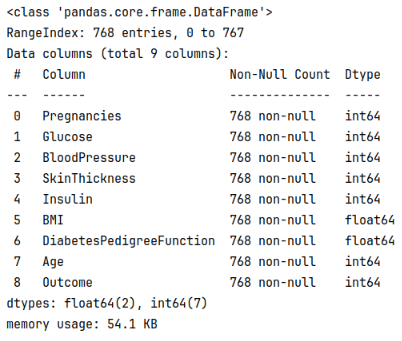
Terlihat pada gambar di atas terdapat 768 data dan 9 kolom/fitur pada dataset. Tidak ditemukan adanya missing value pada
masing-masing fitur. Untuk kolom Pregnancies, Glucose, BloodPressure, SkinThickness, Insulin, Age, dan Outcome memiliki
tipe data int64. Kemudian, untuk kolom BMI dan DiabetesPedigreeFunction memiliki tipa data float64.

#### Melihat Deskripsi Statistik pada Dataset

Berikut ini adalah deskripsi statistik dari dataset.

|       | Pregnancies | Glucose    | BloodPressure | SkinThickness | Insulin    | BMI        | DiabetesPedigreeFunction | Age        | Outcome    |
|-------|-------------|------------|---------------|---------------|------------|------------|--------------------------|------------|------------|
| count | 768.000000  | 768.000000 | 768.000000    | 768.000000    | 768.000000 | 768.000000 | 768.000000               | 768.000000 | 768.000000 |
| mean  | 3.845052    | 120.894531 | 69.105469     | 20.536458     | 79.799479  | 31.992578  | 0.471876                 | 33.240885  | 0.348958   |
| std   | 3.369578    | 31.972618  | 19.355807     | 15.952218     | 115.244002 | 7.884160   | 0.331329                 | 11.760232  | 0.476951   |
| min   | 0.000000    | 0.000000   | 0.000000      | 0.000000      | 0.000000   | 0.000000   | 0.078000                 | 21.000000  | 0.000000   |
| 25%   | 1.000000    | 99.000000  | 62.000000     | 0.000000      | 0.000000   | 27.300000  | 0.243750                 | 24.000000  | 0.000000   |
| 50%   | 3.000000    | 117.000000 | 72.000000     | 23.000000     | 30.500000  | 32.000000  | 0.372500                 | 29.000000  | 0.000000   |
| 75%   | 6.000000    | 140.250000 | 80.000000     | 32.000000     | 127.250000 | 36.600000  | 0.626250                 | 41.000000  | 1.000000   |
| max   | 17.000000   | 199.000000 | 122.000000    | 99.000000     | 846.000000 | 67.100000  | 2.420000                 | 81.000000  | 1.000000   |

Dari tabel di atas terlihat jumlah, rata-rata, standard deviasi, nilai minimum dan maksimum, dan kuartil 1 - 3 untuk
masing-masing fitur numerik. Pada tabel terlihat untuk kolom Glucose, BloodPresure, SkinThickness, Insulin, dan BMI
untuk nilai minimal adalah 0. Hal ini sangat tidak mungkin karena nilai tersebut untuk setiap orang pasti memilikinya.
Oleh
karena itu, permasalahan missing value ini perlu ditangani.

#### Melihat Distribusi Data pada Tiap Kolom

Menggunakan fungsi hist() untuk melihat distribusi data dari masing-masing fitur.
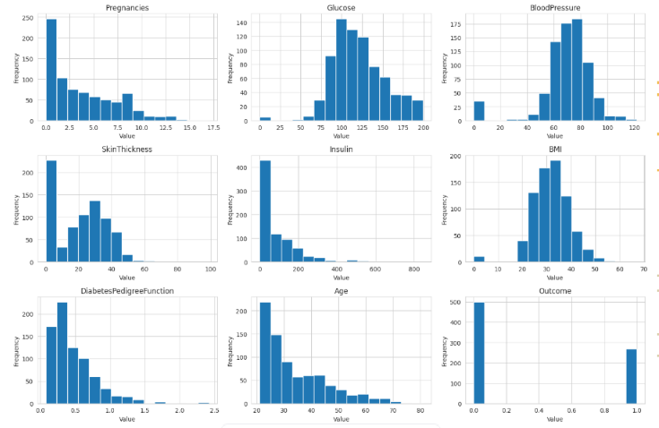
Dari hasil distribusi data di atas, sebagian besar variabel kesehatan dalam dataset memiliki hubungan positif yang lemah
hingga sedang satu sama lain, artinya ketika satu nilai cenderung naik, nilai lainnya juga cenderung naik. Korelasi
positif yang paling menonjol dan terkuat adalah antara Age (Usia) dan Pregnancies (Jumlah Kehamilan). Selain itu,
hubungan yang cukup berarti juga terlihat antara SkinThickness (Ketebalan Kulit) dengan Insulin dan BMI. Di sisi lain,
hampir tidak ada korelasi negatif yang kuat dalam data ini, karena semua hubungan negatif yang ada nilainya sangat kecil
dan mendekati nol, menandakan tidak ada hubungan terbalik yang signifikan antar variabel.

#### Melihat Korelasi Fitur

Menggunakan fungsi corr() untuk mendapatkan nilai korelasi antar fitur dan melakukan plot dengan heatmap().
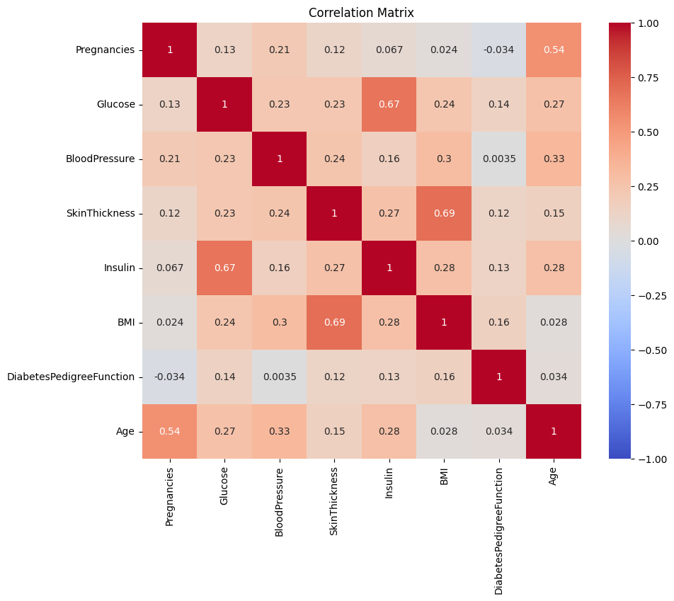
Gambar di atas adalah heatmap yang menampilkan nilai korelasi antar fitur. Terlihat fitur Age dan Pregnancies memiliki
korelasi sebesar 0.54. Fitur ini memiliki nilai korelasi yang cukup tinggi. Untuk pasangan fitur lainnya kurang dari
0.50 dan bisa dikatakan memiliki
korelasi yang lemah.

#### Melihat Distribusi Risiko Wanita Diabetes dan Non-Diabetes

Pada dataset ini terdapat dua label yaitu diabetes dan non-diabetes. Wanita yang berisiko diabetes berjumlah 268 orang
dan non-diabates sebanyak 500 orang. Berikut ini adalah plot distribusi dari wanita berisiko diabetes dan tidak.

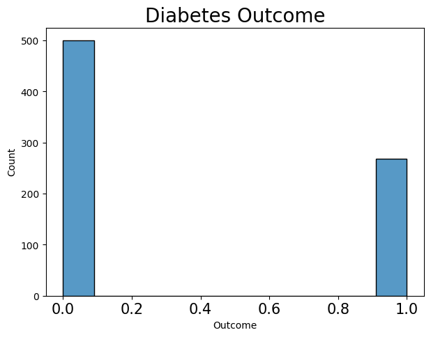

#### Melihat Distribusi Jumlah Wanita berdasarkan Umur

Rentang umur dibagi menjadi lima kategori yaitu youth, maturity, middle-maturity, full-maturity dan elderly.

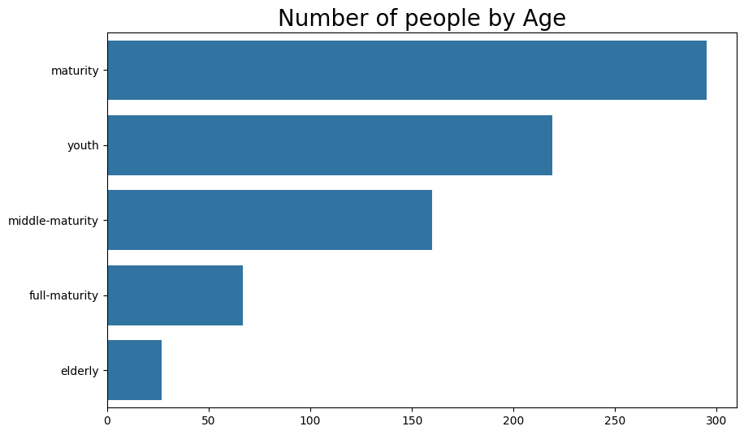

Wanita dengan kategori maturity memiliki jumlah paling banyak yaitu 295 orang, diikuti dengan kategori youth 219 orang,
middle-maturity 160 orang, full-maturity 67 orang dan kategori elderly paling sedikit berjumlah 27 orang.

#### Melihat Distribusi Kelas berdasarkan Umur

Terdapat dua kelas yaitu diabetes dan non-diabetes. Berikut ini plot distribusi kelas berdasarkan kategori umur yaitu
youth, maturity, middle-maturity, full-maturity dan elderly.

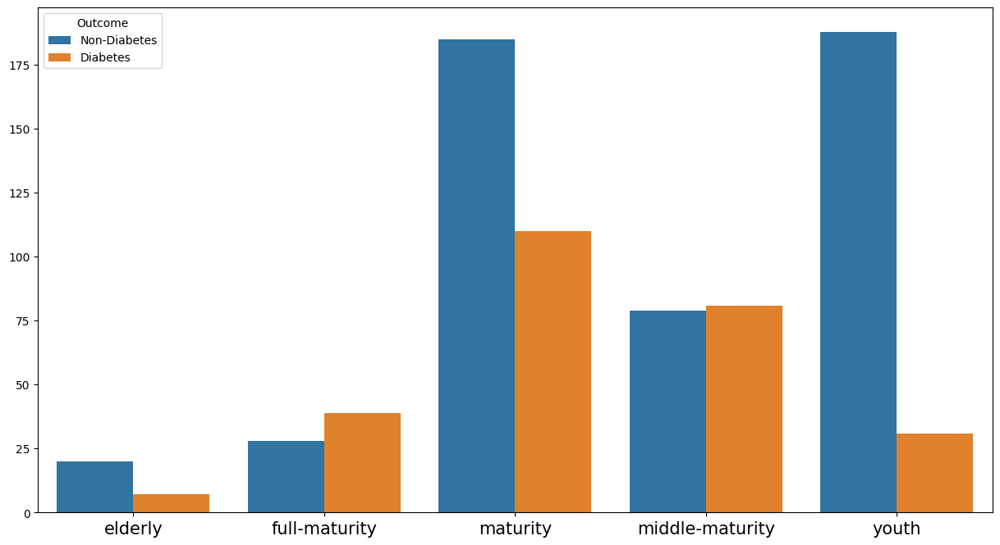

Terlihat pada plot distribusi di atas, wanita dengan kategori elderly yang berisiko diabetes jumlahnya 7 orang dan
non-diabetes 20 orang. Kategori kedua yaitu full-maturity, wanita yang berisiko diabetes jumlahnya 39 orang dan
non-diabetes 28 orang. Kemudian kategori maturity, wanita yang berisiko diabetes jumlahnya 110 orang dan non-diabetes
185 orang. Kategori keempat yaitu middle-maturity, wanita yang berisiko diabates jumlahnhya 81 orang dan 79 orang
non-diabetes. Lalu, untuk kategori terakhir yaitu youth, wanita yang berisiko diabetes berjumlah 31 orang dan 188
non-diabetes.

#### Melihat Distribusi Kelas berdasarkan BMI

Terdapat 4 kategori dari hasil perhitungan BMI yaitu normal, obese, overweight dan underweight. Berikut ini adalah plot
distribusi jumlah kelas berdasarkan nilai BMI.

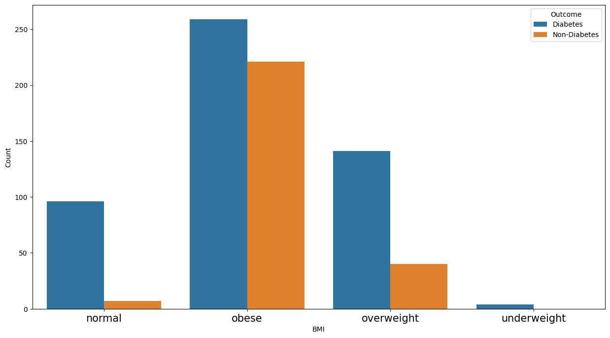

Terlihat pada gambar plot distribusi di atas, wanita yang masuk dalam kategori obese berjumlah 480 orang. Kemudian untuk
wanita yang termasuk dalam kategori obese dan berisiko diabetes berjumlah 221 orang dan non-diabetes 259 orang. Kemudian
urutan kedua yaitu ketegori overweight 181 orang dengan wanita yang berisiko diabetes berjumlah 40 orang dan 141 orang
non-diabetes. Urutan ketiga, kategori normal jumlahnya 103 orang dan wanita yang berisiko diabetes sebanyak 7 orang dan
non-diabates 96 orang. Lalu, urutan terakhir yaitu kategori underweight jumlahnya 4 orang dan termasuk non-diabates.

#### Melihat Distribusi Kelas berdasarkan Tekanan Darah

Terdapat 4 kategori berdasarkan hasil tekanan darah yaitu normal, pre-hypertension, stage-1-hypertension dan
stage-2-hypertension.

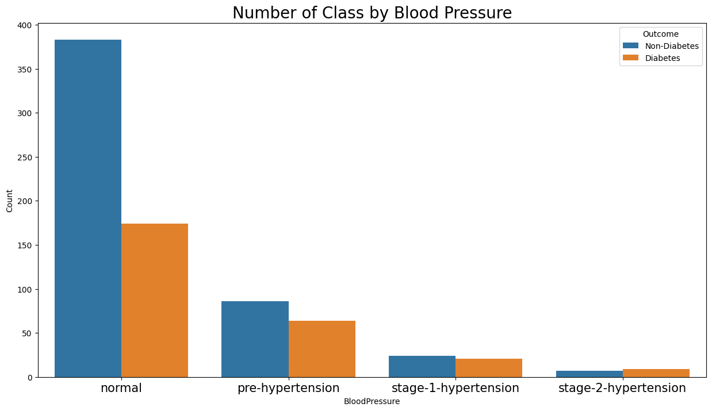

Terlihat pada plot distribusi di atas, wanita yang memiliki tekanan darah normal berjumlah 557 orang dengan 174 orang
berisiko diabetes dan 383 non-diabates. Kemudian wanita yang masuk kategori pre-hypertension berjumlah 150 orang, dengan
64 orang berisiko diabetes dan 86 non-diabates. Lalu, untuk wanita yang masuk ke stage-1-hypertension berjumlah 45 orang
dengan 21 orang berisiko diabates dan 24 orang non-diabates. Kategori terakhir, wanita dengan stage-2-hypertension
jumlahnya 16 orang dengan 9 orang berisiko diabetes dan 7 non-diabates.

#### Melihat Outlier pada Fitur-Fitur Numerik

Terdapat delapan fitur yang dicek apakah terdapat data outlier atau tidak yaitu Pregnancies, Glucose, BloodPressure,
SkinThickness, Insulin, BMI, DiabetesPedigreeFunction dan Age.

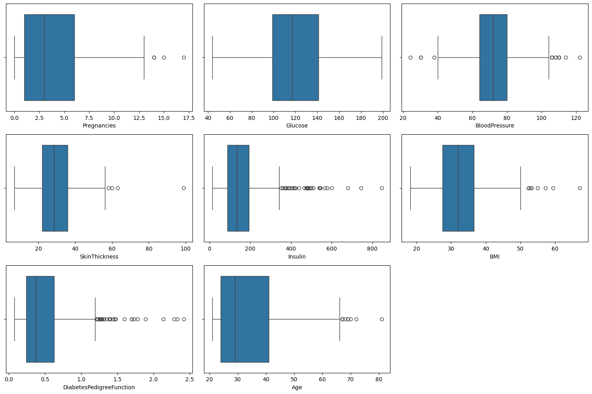

Terlihat pada plot di atas, untuk fitur Pregnancies, BloodPressure, SkinThickness, Insulin, BMI,
DiabetesPedigreeFunction, Glucose dan Age memiliki outlier. Dikarenakan ini adalah kondisi fisiologis dan pasti tiap
orang memiliki kondisi yang berbeda-beda. Untuk mengantisipasi
kehilangan banyak informasi, maka tidak dilakukan penanganan penghapusan outlier.

## Data Preparation

Berikut ini adalah teknik data preparation yang dilakukan pada dataset untuk meningkatkan kualiatas data, supaya model
memiliki performa yang baik dalam memprediksi apakah wanita dengan kondisi fisiologis saat ini berisiko terkena diabetes
atau tidak.

### Features Selection

Feature Selection adalah teknik untuk memilih fitur yang paling penting untuk digunakan dalam model machine learning.
Hal ini perlu dilakukan supaya performa model dapat meningkat dengan membuang fitur yang kurang penting, redundan, atau
kotor. Jadi, kompleksitas model dapat dikurangi, akurasi ditingkatkan dan proses pelatihan menjadi lebih cepat. Pada
project ini digunakan teknik pemilihan fitur yaitu Embedded Method.

Embedded Method merupakan metode yang menggabungkan pemilihan fitur dan pelatihan model. Metode ini memungkinkan model
untuk mempelajari hubungan antara fitur dan variabel target bersamaan dengan memilih fitur yang relevan dengan target.
Berikut ini potongan kode penggunaan **Embedded Method**.

```python
rf_model = RandomForestClassifier(n_estimators=100, random_state=42)
rf_model.fit(X, y)

importance = rf_model.feature_importances_
indices = np.argsort(importance)[::-1]

threshold = 0.05
important_features_indices = [i for i in range(len(importance)) if importance[i] >= threshold]
```

Terlihat digunakan algoritma Random Forest untuk mencari fitur yang relevan dan menetapkan threshold sebesar 0.05. Fitur
yang memiliki nilai di atas sama dengan 0.05 akan dipilih.

### Melakukan Spliting Data

Spliting data adalah proses untuk membagi data menjadi dua bagian yaitu data training dan data test. Hal ini perlu
dilakukan agar bisa melakukan uji coba model dengan data yang belum dilihat oleh model. Pada project ini pembagian
dataset adalah 80:20. Untuk membagi dataset ini digunakan fungsi train_split_test().

### Imputasi Data

Dari hasil fungsi describe() untuk kolom Glucose, BloodPresure, SkinThickness, Insulin, dan BMI nilai minimumnya
adalah 0. Kondisi tersebut tidak logis dan dapat dianggap sebagai missing value. Berikut ini adalah potongan kode yang
digunakan untuk menghitung jumlah data yang bernilai 0.

```python
miss_val_count = (diabetes_df[col] == 0).sum()
```

Gambar di bawah ini adalah jumlah data yang terdapat 0 pada masing-masing kolom.

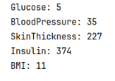
Pada kolom Glocose terdapat 5 data yang terdapat nilai 0, BloodPressure ada 35 data, SkinThickness ada 227 data, Insulin
ada 374 data, dan kolom BMi ada 11 data. Untuk menangani masalah missing value digunakan metode imputasi regresi.

```python
IterativeImputer(estimator=RandomForestRegressor(random_state=42), random_state=42, missing_values=0)
```

Kode di atas adalah penggunaan regresi dengan estimator yaitu RandomForestRegressor untuk mengatasi missing value.
Imputasi regresi bekerja dengan cara memperhitungkan hubungan antara variabel dan mempertahankan distribusi asli. Hal
ini dapat mengurangi bias dan meningkatkan akurasi dalam mengimputasikan nilai yang hilang.

### Melakukan Scaling Feature

Scaling feature adalah teknik untuk menyesuaikan rentang nilai pada fitur supaya berada dalam rentang yang seragam. Hal
ini perlu dilakukan karena ada beberapa model yang cukup sensitif dengan perbedaan rentang antara fitur contohnya model
K-Nearest-neighbors. Pada project ini digunakan **MinMaxScaler()** untuk mengubah skala fitur berada dalam
rentang [0, 1].

### Melakukan Oversampling dengan SMOTE

Oversampling adalah teknik untuk menambahkan sampel data pada kelas minoritas sehingga jumlahnya menjadi seimbang dengan
kelas mayoritas. Jumlah kelas diabates pada data latih adalah 214 dan non-diabates 400.
Dari nilai tersebut, ini menandakan keadaan imbalance dataset. Oleh karena itu, perlu dilakukan teknik oversampling pada
kelas diabates.

Jika terjadi situasi imbalance dataset, perlu dilakukan teknik oversampling. Karena, model machine learning cenderung
lebih baik dalam memprediksi kelas mayortas dan mengabaikan atau salah mengklasifikasikan kelas minoritas.

Salah satu metode untuk menerapkan teknik oversampling adalah SMOTE. SMOTE adalah metode oversampling yang canggih dan
kompleks. Metode ini menghasilkan sample data baru dengan melakukan interpolasi antara dua data minoritas yang ada untuk
membuat data yang baru. Berikut ini adalah potongan kode untuk melakukan oversampling dengan metode SMOTE.

```python
# Inisialisasi SMOTE
smote = SMOTE(random_state=42)

# Melakukan oversampling pada data train
X_train_resampled, y_train_resampled = smote.fit_resample(X_train_std, y_train)
```

### Dimension Reduction

Teknik reduksi dimensi adalah teknik untuk mengurangi jumlah fitur dengan tetap mempertahankan informasi pada data.
Salah satu teknik pengurangan dimensi yang terkenal dan digunakan pada project ini adalah PCA (Principal Component
Analysis). PCA adalah teknik untuk mereduksi dimensi dan mengekstraksi fitur.

Pada saat melakukan tahapan EDA terdapat fitur yang memiliki korelasi yang cukup tinggi yaitu Age dan
Pregnancies memiliki korelasi sebesar 0.54.
Salah satu kegunaan dari PCA adalah untuk mengatasi masalah multikolinearitas. Ini adalah kondisi di mana dua atau lebih
variabel independen memiliki hubungan linier yang kuat satu sama lain. Pada project ini saya mencoba menetapkan
threshold yaitu 0.5. Berikut ini adalah potongan kode untuk menerapkan teknik PCA.

```python
# Inisialisasi PCA
pca = PCA(n_components=0.9, random_state=42)

# Melakukan PCA untuk data train pada kolom yang memiliki korelasi cukup tinggi
X_train_pca = pca.fit_transform(X_train_resampled[high_corr_cols])

# Menerapkan PCA untuk data latih
X_test_pca = pca.transform(X_test_std[high_corr_cols])

# Membuat dataframe baru untuk menyimpan hasil reduksi
df_train_pca = pd.DataFrame(data=X_train_pca, columns=['pca_1', 'pca_2'])
df_test_pca = pd.DataFrame(data=X_test_pca, columns=['pca_1', 'pca_2'])
```

Terlihat pada kode di atas, saat inisialisasi PCA untuk parameter n_components ditetapkan nilai sebesar 0.9. Parameter
n_components ini membuat algoritma PCA secara otomatis menentukan jumlah komponen yang diperlukan untuk menangkap 90%
variansi dari data.

## Modeling

Pada tahap ini, dilakukan proses pembuatan model machine learning untuk memprediksi apakah seorang wanita berisiko
terkena diabates atau tidak. Proses ini mencakup pemilihan algoritma yaitu Random Forest, K-Nearest-Neighbor dan
Logistic Regression. Kemudian melakukan pelatihan model awal, lalu meningkatkan perfoma model melalui hyperparameter
tuning dan memilih model dengan hasil terbaik dengan memperhatikan metrik seperti akurasi, presisi, recall dan f-1 score
setelah dilakukan tuning.

### Random Forest

Random Forest adalah algoritma ensemble learning yang menggabungkan beberapa Decision Tree untuk meningkatkan akurasi,
prediksi dan mengurangi risiko overfitting. Setiap pohon dalam Random Forest dilatih menggunakan subset acak dari data
pelathan dan subset acak dari fitur yang tersedia. Tujuan dari Random Forest adalah mengatasi kelemahan dari Decision
Tree yang cenderung overfitting terhadap data pelatihan.

Pada project ini, saat pertama kali melakukan modeling menggunakan Random Forest parameter yang digunakan hanya
random_state dengan nilai 42. Parameter ini digunakan untuk memastikan seluruh proses pelatihan dari pengambilan sampel
data hingga pemilihan fitur acak di setiap pohon selalu sama, sehingga saat menjalankan ulang kode model yang dihasilkan
akan sama.

Kemudian saat melakukan hyperparameter tuning menggunakan GridSearchCV, parameter yang digunakan adalah sebagai berikut:

- n_estimators: jumlah pohon keputusan  [10, 50, 100, 300]
- max_depth:  kedalaman maksium dari setiap pohon [1 - 10]
- min_samples_split: jumlah minimum sampel untuk membagi sebuah node dalam pohon  [2 - 10]

Setelah proses GridSearchCV selesai, kombinasi hyperparameter terbaik yang ditemukan adalah:

- n_estimators: 300
- min_samples_split: 3
- max_depth: 9

**Kelebihan Random Forest**

- Memberikan akurasi yang baik katena menggabungkan banyak Decision Tree
- Mengurangi risiko overfitting dengan menggabungkan hasil dari banyak Decision Tree
- Dapat menangani data dengan kelas yang tidak seimbang
-

**Kekurangan Random Forest**

- Memerlukan memori besar, terutama dengan banyak pohon
- Model sulit diinterpretasikan dibandingkan dengan Decision Tree tunggal
- Prediksi bisa lambat jika model memiliki banyak pohon dan dataset yang besar

### K-Nearest-Neighbors

K-Nearest-Neighbor adalah algoritma yang digunakan untuk mengklasifikasikan data baru berdasarkan kedekatannya dengan
data yang sudah diberi label dalam dataset pelatihan. KNN sering digunakan karena kemudahannya dalam pemahaman dan
implementasi meskipun pada praktiknya, KNN dapat menjadi sangat efektif untuk berbagai masalah klasifikasi.

Pada project ini, saat pertama kali melakukan modeling menggunakan K-Nearest-Neighbor tidak ada parameter yang diatur.
Saat fiting model, hanya menerapkan nilai default dari parameter KNN.

Kemudian saat melakukan hyperparameter tuning menggunakan GridSearchCV, parameter yang digunakan adalah sebagai berikut:

- n_neighbors: jumlah tetangga terdekat [5 - 20]
- metric: digunakan untuk mengukur seberapa dekat atau mirip dua titik dalam ruang
  fitur [minkowski, manhattan, euclidean]

Setelah proses GridSearchCV selesai, kombinasi hyperparameter terbaik yang ditemukan adalah:

- n_neighbors: 7
- metric: manhattan

**Kelebihan K-Nearest-Neighbor**

- Mudah dipahami dan diimplementasikan tanpa banyak asumsi
- Tidak mengasusmsikan distribusi data tertentu, cocok untuk berbagai jenis data
- Cocok untuk dataset kecil dengan interpretasi langsung dan hasil cepat

**Kekurangan K-Nearest-Neighbor**

- Perhitungan jarak untuk setiap prediksi membuat KNN lambar pada dataset yang besar
- Data yang tidak sesuai atau fitur yang tidak relevan dapat menurunkan akurasi prediksi
- Kebutuhan memori meningkat pada dataset besar

### Logistic Regression

Logistic Regression adalah teknik pemodelan statistik yang digunakan untuk memprediksi hasil biner, yaitu hasil dengan
dua kemungkinan. Regresi logistik digunakan untuk memodelkan probabilitas bahwa suatu kejadian akan terjadi (hasil
biner).

Pada project ini, saat pertama kali melakukan modeling menggunakan Logistic Regression parameter yang digunakan hanya
random_state dengan nilai 42. Parameter ini digunakan untuk memastikan seluruh proses pelatihan dari pengambilan sampel
data hingga perhitungan bobot selalu sama, sehingga saat menjalankan ulang kode model yang dihasilkan akan sama.

Kemudian saat melakukan hyperparameter tuning menggunakan GridSearchCV, parameter yang digunakan adalah sebagai berikut:

- C: nilai regulasi [0.1, 1, 10]
- penalty: jenis penalty yang diberikan pada model [l2, l1, elasticnet]
- solver:  algoritma optimasi [lbfgs, liblinear. saga]

Setelah proses GridSearchCV selesai, kombinasi hyperparameter terbaik yang ditemukan adalah:

- C: 10
- penalty: l1
- solver:  liblinear

**Kelebihan Logistic Regression**

- Proses pelatihan yang cepat pada dataset besar
- Hasilnya mudah untuk diinterpretasikan
- Model ini tidak memerlukan banyak memori yang besar

**Kekurangan Logistic Regression**

- Model ini mengasusmsikan hubungan antara fitur-fitur dari hasil adalah linear
- Tidak dapat menangkap pola yang kompleks
- Sensitif terhadap multikolinearitas

### Pemilihan Model Terbaik

Untuk memilih model terbaik yang dapat memprediksi apakah wanita dengan kondisi fisiologis saat ini berisiko diabates
atau tidak dilakukan setelah melakukan hyperparameter tuning dengan memperhatikan metrik akurasi, prediksi, recall dan
f1_score.

## Evaluation

Pada tahap evaluasi digunakan beberapa metrik yaitu confusion matrix, akurasi, prediksi, recall dan f1_score untuk
menentukan model yang terbaik.

### Confusion Matrix

Confusin matrix adalah alat yang digunakan untuk mengevaluasi kinerja model klasifikasi dengan menunjukkan jumlah
prediksi yang benar dan salah dalam format tabel. Berikut ini adalah emapt jenis evaluator dalam confusion matrix:

- True Positive (TP): Jumlah kelas positif yang benar-benar diprediksi sebagai prositif
- True Negative (TN): Jumlah kelas negatif yang benar-benar diprediksi sebagai negatif
- False Positve (FP): Jumlah kelas negatif yang diprediksi sebagai positif (kesalahan tipe 1)
- False Negative (FN): Jumlah kelas positif yang diprediksi sebagai negatif (kesalahan tipe 2)

### Akurasi

Akurasi adalah metrik yang digunakan untuk mengukur kinerja model klasifikasi. Akurasi dihitung sebagai proporsi dari
prediksi baik (positif atau negatif) terhadap seluruh prediksi yang dilakukan oleh model.

$$Akurasi = \frac{TP + TN}{TP + TN + FP + FN}$$

### Precision

Precision adalah metrik yang digunakan untuk mengukur seberapa baik model menghindari FP. Metrik ini adalah rasio
prediksi positif yang benar terhadap semua prediksi positif yang dibuat oleh model.

$$Precision = \frac{TP}{TP + FP}$$

### Recall

Recall adalah metrik yang digunakan untuk mengukur seberapa baik model dapat menangkap semua contoh positif. Metrik ini
adalah rasio prediksi positif yang benar terhadap semua kasus positif yang sebenarnya ada dalam data.

$$Recall = \frac{TP}{TP + FN}$$

### F1_Score

F1_Score adalah metrik yang menggabungkan presisi dan recall menjadi satu nilai tunggal yang mempehatikan keduanya.
F1_Score adalah metrik yang menghitung rata-rata harmonis dari presisi dan recall, memberikan gambaran yang lebih baik
ketika trade-off antara keduanya.

$$F1-Score = 2 * \frac{Precision * Recall}{Precision + Recall}$$

### Hasil Performa Model

Berikut ini adalah hasil performa model sebelum dilakukan hyperparameter tuning dan setelah.

**Sebelum Hyperparameter Tuning**

Berikut ini hasil dari confusion matrix, metrik akurasi, presisi, recall dan f1_score sebelum dilakukan hyperparameter
tuning.

**Confusion Matrix**

<div style="display: flex; justify-content: space-between; gap: 10px;">
  <div style="width: 32%; height: auto; display:flex; flex-direction:column;align-items:center">
  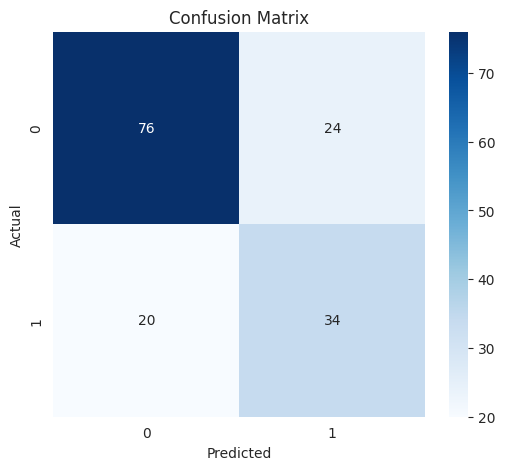
  <p style="font-weight:bold">Random Forest</p>
  </div>
  <div style="width: 32%; height: auto; display:flex; flex-direction:column;align-items:center">
   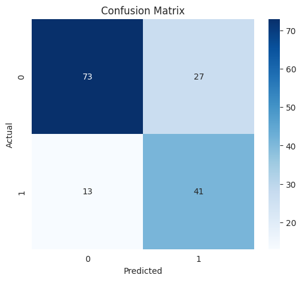
     <p style="font-weight:bold">K-Nearest-Neighbors</p>
  </div>
  <div style="width: 32%; height: auto; display:flex; flex-direction:column;align-items:center">
  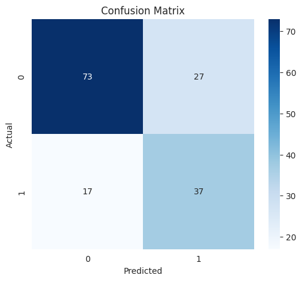
  <p style="font-weight:bold">Logistic Regression</p>
  </div>
</div>

**Keterangan Confusion Matrix**

| Model               | TP | TN | FP | FN |
|---------------------|----|----|----|----|
| Random Forest       | 76 | 35 | 19 | 24 |
| K-Nearest-Neighbor  | 73 | 41 | 13 | 27 |
| Logistic Regression | 73 | 37 | 17 | 27 |

**Tabel Metrik Evaluasi**

| Model               | Accuracy | Precision | Recall   | F1-Score |
|---------------------|----------|-----------|----------|----------|
| Random Forest       | 0.720779 | 0.593220  | 0.648148 | 0.619469 |
| K-Nearest-Neighbor  | 0.740260 | 0.602941  | 0.759259 | 0.672131 |
| Logistic Regression | 0.714286 | 0.578125  | 0.685185 | 0.627119 |

**Setelah Hyperparameter Tuning**

Berikut ini hasil dari confusion matrix, metrik akurasi, presisi, recall dan f1_score setelah dilakukan hyperparameter
tuning.

**Confusion Matrix**

<div style="display: flex; justify-content: space-between; gap: 10px;">
  <div style="width: 32%; height: auto; display:flex; flex-direction:column;align-items:center">
  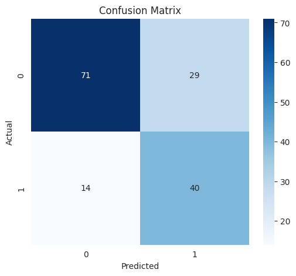
  <p style="font-weight:bold">Random Forest</p>
  </div>
  <div style="width: 32%; height: auto; display:flex; flex-direction:column;align-items:center">
   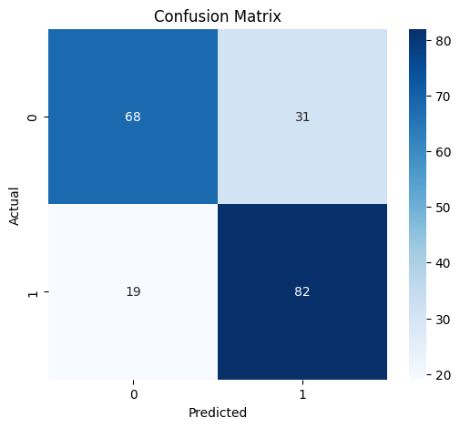
     <p style="font-weight:bold">K-Nearest-Neighbors</p>
  </div>
  <div style="width: 32%; height: auto; display:flex; flex-direction:column;align-items:center">
  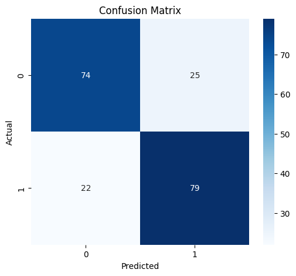
  <p style="font-weight:bold">Logistic Regression</p>
  </div>
</div>

**Keterangan Confusion Matrix**

| Model               | TP | TN | FP | FN |
|---------------------|----|----|----|----|
| Random Forest       | 72 | 41 | 13 | 28 |
| K-Nearest-Neighbor  | 72 | 37 | 17 | 28 |
| Logistic Regression | 73 | 39 | 15 | 27 |

**Tabel Metrik Evaluasi**

| Model               | Accuracy | Precision | Recall   | F1-Score |
|---------------------|----------|-----------|----------|----------|
| Random Forest       | 0.733766 | 0.594203  | 0.759259 | 0.666667 |
| K-Nearest-Neighbor  | 0.707792 | 0.569231  | 0.685185 | 0.621849 |
| Logistic Regression | 0.727273 | 0.590909  | 0.722222 | 0.650000 |

Setelah dilakukan hyperparameter tuning dapat diambil kesimpulan sebagai berikut.

- **Model Random Forest** akurasi dari 0.720779 menjadi 0.733766, precision dari 0.593220 menjadi 0.594203, recall dari
  0.648148 menjadi 0.759259 dan f1_score dari 0.619469 menjadi 0.666667.
- **Model K-Nearest-Neighbors** akurasi dari 0.740260 menjadi 0.707792, precision dari 0.602941 menjadi 0.569231, recall
  dari 0.759259 menjadi 0.685185 dan f1_score dari 0.672131 menjadi 0.621849.
- **Model Logistic Regression** akurasi dari 0.714286 menjadi 0.727273, precision dari 0.578125 menjadi 0.590909, recall
  dari
  0.685185 menjadi 0.722222 dan f1_score dari 0.627119 menjadi 0.650000.

Dari hasil di atas untuk nilai metrik setelah dilakukan hyperparameter tuning ada yang mengalami kenaikan ada yang
turun.
Untuk model Random Forest metrik akurasi, precision, recall dan f1-score mengalami kenaikan. Kemudian untuk model KNN,
metrik akurasi, precision, recall dan f1-score mengalami penurunan. Lalu, model Logistic Regresion untuk metrik akurasi,
precision, recall dan f1-score mengalami kenaikan.

### Kesimpulan

Setalah dilakukan pelatihan model, hyperparameter tuning dan evaluasi model didapatkan hasil model dengan performa
terbaik adalah Random Forest.

- Accuracy: 0.733766
- Precision: 0.594203
- Recall: 0.759259
- F1-Score: 0.666667
